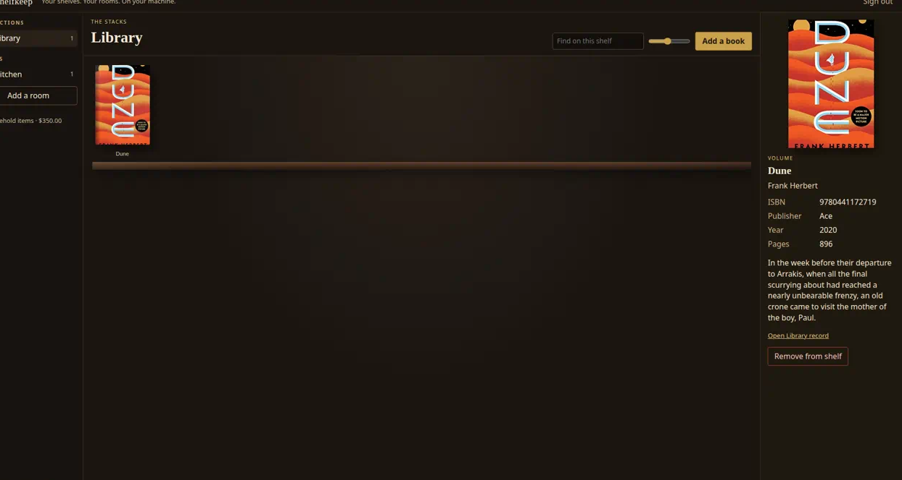
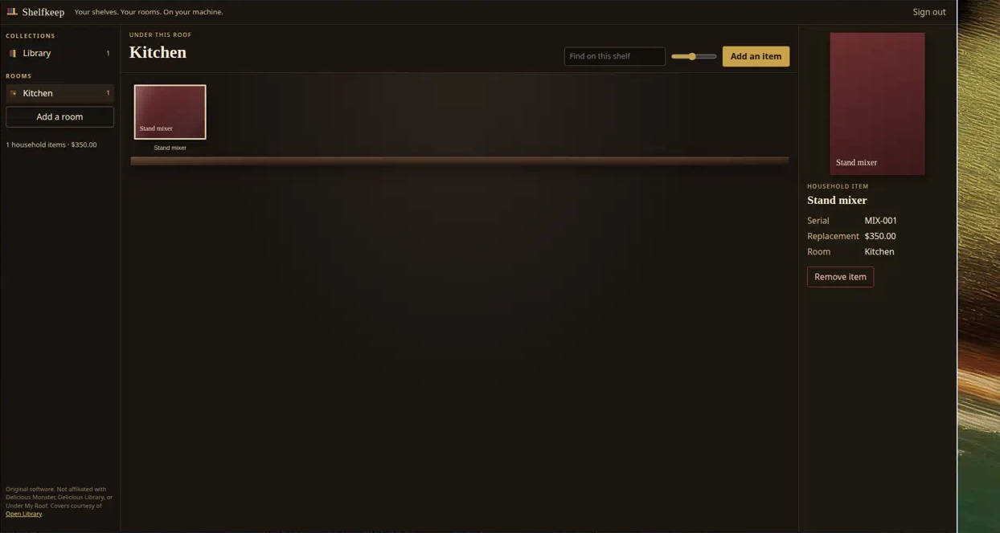

# Shelfkeep

Self-hosted catalog for the things you keep: a library you browse like a room, and a home inventory that is useful when you need it.

Add a book by ISBN, title, or by hand and see it on a wooden shelf with cover art. Walk rooms, photograph household items, and keep serial numbers, purchase dates, replacement values, and receipts — insurance-friendly without becoming a spreadsheet.

Shelfkeep is a web app (responsive, installable as a PWA). It is not Mac-only. `docker compose up` is the happy path. There is no required cloud account. [MIT](LICENSE). See [CHANGELOG](CHANGELOG.md) for v1.0.0, [SECURITY](SECURITY.md) for the default-password warning, and [CONTRIBUTING](CONTRIBUTING.md) if you want to help.

## Screenshots

Library shelf — *Dune* on the plank, Open Library cover, inspector on the right.



Kitchen — a household item on the same kind of shelf, with serial and replacement value.



## Why

Physical collections and household stuff are the same problem: you want to *see* what you have, not row through a grid. Shelfkeep keeps the tactile, cover-forward feeling of a personal library and extends it to the rest of the house.

## Non-affiliation

**Shelfkeep is original open-source software.** It is **not** affiliated with, endorsed by, or a substitute product of Delicious Monster, Delicious Library, or Under My Roof. We do not copy their trademarks, artwork, copy, or proprietary library formats.

The interface is inspired by the *feeling* of browsing real shelves — not a clone of any commercial app.

## Features (v1)

- Three-pane workspace: collections and rooms on the left, a shelf of object-like covers in the center, details on the right
- Wooden-shelf library with large cover art (sheen, spine, and shadow — original, not a clone)
- Add books by ISBN, title lookup, or manual entry
- Public metadata from [Open Library](https://openlibrary.org) (covers and bibliographic data), with a graceful fallback if lookup fails
- Optional on-device barcode scan in browsers that implement `BarcodeDetector` (Chromium)
- Rooms and household items with photo upload, serial, purchase date, replacement value, and receipts
- Single-user local login (username and password from environment)
- PWA manifest and a small offline app-shell cache
- Postgres + persisted volumes via Docker Compose

## Install

Three ways to run Shelfkeep. **Docker Compose + Postgres is the happy path.**
There is no required cloud account and no Kubernetes. End users do not need
a GitHub account to pull the public image or download a release binary.

### 1. Docker Compose (recommended)

You need Docker and Docker Compose. This builds the image locally and runs
Postgres beside the app.

```bash
cp .env.example .env
# Edit .env: set SHELFKEEP_PASSWORD. Leave SESSION_SECRET blank to generate one.
docker compose up --build
```

Open [http://localhost:8080](http://localhost:8080) and sign in with `SHELFKEEP_USERNAME` / `SHELFKEEP_PASSWORD` (defaults in `.env.example` are `admin` / `changeme`).

Data lives in Docker volumes:

- `db_data` — PostgreSQL
- `uploads` — cover art, item photos, receipts

Stop with `Ctrl+C`, or `docker compose down`. Volumes persist until you `docker compose down -v`.

The first `up --build` compiles the Python image (a minute or two). The app waits until Postgres is healthy, then serves `/` and `/healthz`. Leave `SESSION_SECRET` blank so a unique cookie key is written under the `uploads` volume. Do **not** set `DATABASE_URL` in `.env` for Compose; a host SQLite URL would be the wrong database. If port `8080` is already taken, stop the other process or change the published port on the `app` service.

### 2. Published Docker image (GHCR)

The same [Dockerfile](Dockerfile) is published as `ghcr.io/jstaud/shelfkeep`
on `v*` tags (also tagged `latest`) and on `main`. No GitHub login is required
once the package is public.

**Compose, using the image instead of a local build:**

```bash
cp .env.example .env
# Edit .env: set SHELFKEEP_PASSWORD. Leave SESSION_SECRET blank.
export SHELFKEEP_IMAGE=ghcr.io/jstaud/shelfkeep:latest
docker compose pull app
docker compose up
```

`docker-compose.yml` already declares `image: ${SHELFKEEP_IMAGE:-shelfkeep:local}`
plus `build: .`, so `up --build` stays the local happy path.

**Standalone `docker run` (SQLite, no Postgres):**

```bash
docker pull ghcr.io/jstaud/shelfkeep:latest
docker run --rm -p 8080:8080 \
  -e SHELFKEEP_PASSWORD=changeme \
  -e DATA_DIR=/data \
  -v shelfkeep-data:/data \
  ghcr.io/jstaud/shelfkeep:latest
```

Uploads and the SQLite file live in the `shelfkeep-data` volume. Point
`DATABASE_URL` at Postgres if you already have a database.

Pin a version with `ghcr.io/jstaud/shelfkeep:1.0.1` (or whatever tag you
published). Image tags are lowercase (`jstaud`), matching GHCR.

### 3. Linux or macOS binary

Download a release tarball from
[GitHub Releases](https://github.com/Jstaud/shelfkeep/releases)
(`shelfkeep-linux-x86_64.tar.gz` or `shelfkeep-macos-arm64.tar.gz`).
No Docker and no Python install.

```bash
tar -xzf shelfkeep-linux-x86_64.tar.gz
cd shelfkeep-linux-x86_64
./shelfkeep                 # or: ./install.sh  then  shelfkeep
# http://127.0.0.1:8080
```

`install.sh` copies the binary to `~/.local/bin`. The process binds
**127.0.0.1:8080** by default (`SHELFKEEP_HOST` / `SHELFKEEP_PORT` or
`shelfkeep serve --host … --port …`).

Data defaults to a user-writable directory (SQLite + uploads):

- Linux: `~/.local/share/shelfkeep`
- macOS: `~/Library/Application Support/shelfkeep`

Override with `DATA_DIR`. Optional Postgres: set `DATABASE_URL` (same
SQLAlchemy URL as a source install). Other env vars match the table below.

**macOS Gatekeeper.** CI builds are **unsigned** (no paid Apple Developer
account). After download, macOS may block the binary. Right-click → Open, or:

```bash
xattr -d com.apple.quarantine ./shelfkeep
```

CI publishes **Apple Silicon (arm64)** from `macos-latest`. Intel Macs can
run that build under Rosetta, or build from this repo with PyInstaller
(`packaging/shelfkeep.spec`). Linux CI publishes **x86_64**.

**Producing assets for `v1.0.0` or the next tag.** After this workflow is
on `main`, do **not** retag from a packaging PR. Either:

- push the next `v*` tag — GHCR and binaries publish automatically, or
- dry-run / attach to the existing tag from Actions → **Release binaries**
  → Run workflow, with `attach_to_tag` set to `v1.0.0`, and **GHCR** with
  `image_tag` set to `1.0.0` (and `latest` if you want).

### Without Docker (Python source)

Python 3.12+ is enough. Shelfkeep will use SQLite under `./data` if `DATABASE_URL` is unset.

```bash
python3 -m venv .venv
source .venv/bin/activate
pip install -r requirements-dev.txt
export SHELFKEEP_USERNAME=admin
export SHELFKEEP_PASSWORD=changeme
export SESSION_SECRET=dev-only-secret
uvicorn app.main:app --reload --port 8080
# or: python -m app serve --port 8080
```

### Tests

```bash
pip install -r requirements-dev.txt
pytest -q
```

## Configuration

| Variable | Purpose |
| --- | --- |
| `SHELFKEEP_USERNAME` | Local login name (default `admin`) |
| `SHELFKEEP_PASSWORD` | Local login password (change this) |
| `SESSION_SECRET` | Cookie signing key. If unset or a documented placeholder, a unique key is generated and persisted under `DATA_DIR` |
| `DATABASE_URL` | SQLAlchemy URL for non-Compose runs. Compose does not set this; the app builds an encoded URL from `POSTGRES_HOST` + `POSTGRES_*`. Binary / `docker run` default to SQLite under `DATA_DIR` |
| `POSTGRES_USER` / `POSTGRES_PASSWORD` / `POSTGRES_DB` | Compose Postgres credentials (URL-encoded by the app) |
| `DATA_DIR` | Uploads + generated session secret (Compose / image: `/data`; source: `./data`; Linux binary: `~/.local/share/shelfkeep`; macOS binary: `~/Library/Application Support/shelfkeep`) |
| `SHELFKEEP_HOST` / `SHELFKEEP_PORT` | Bind address for `shelfkeep` / `shelfkeep serve` (default `127.0.0.1` / `8080`). The Docker image still listens on `0.0.0.0:8080` |
| `SHELFKEEP_IMAGE` | Compose image name (default `shelfkeep:local`). Set to `ghcr.io/jstaud/shelfkeep:latest` to pull instead of building |
| `SESSION_HTTPS_ONLY` | Set `true` if you terminate TLS in front of the app |

The process logs a warning if the default login password is still in use. A missing or placeholder `SESSION_SECRET` is never used to sign cookies.

## Stack

Boring on purpose: **FastAPI**, **SQLAlchemy**, **PostgreSQL** (SQLite for tests / binaries / no-Docker), vanilla HTML/CSS/JS, Docker Compose. Optional GHCR image and PyInstaller binaries. No Kubernetes, no cloud account, no extra JS build step.

Book lookup uses documented Open Library APIs:

- `https://openlibrary.org/api/books` (ISBN → metadata)
- `https://openlibrary.org/search.json` (title search)
- `https://covers.openlibrary.org/b/isbn/{isbn}-L.jpg?default=false` (cover art)

If Open Library is unreachable or has no record, you can still file the book by hand. A cloth-bound placeholder is shown when there is no cover.

## Out of scope (for now)

- Native mobile apps (the PWA is the install path)
- Multi-tenant SaaS
- Amazon (or other retailer) scraping
- Importing proprietary Delicious Library libraries

Those are future work, not part of this first slice.

## License

[MIT](LICENSE). Please read [SECURITY](SECURITY.md) before exposing an instance,
and [CONTRIBUTING](CONTRIBUTING.md) before sending a patch.
